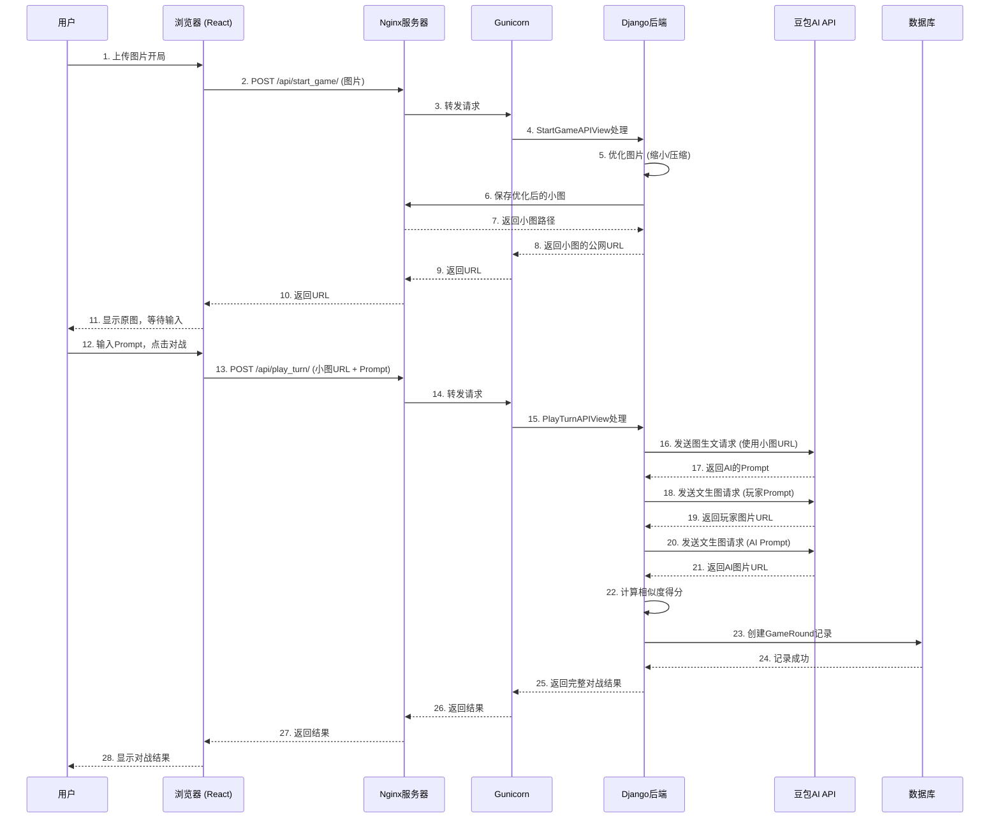

<div align="center">

  

  # **Picture Talk: Human vs AI**
  ### 看图说话：人机对抗游戏

  **一个基于大语言模型和图像识别技术构建的全栈Web应用，在这里，人类将与AI在文生图提示词编写领域一决高下。**

</div>

<div align="center">
  
  
  
  
  
  
</div>

<br>

## 🚀 产品简介 (Product Introduction)

**Picture Talk** 是一款创新的人机对抗游戏。游戏的核心在于测试并比较人类与AI在理解图像并将其转化为有效“提示词 (Prompt)”的能力。

### 核心玩法
1.  **获取原图**: 系统提供一张“原图”，图片可能由AI生成，或由玩家上传。
2.  **提示词对决**: 玩家（人类）与游戏内置的AI Bot，分别根据原图编写一个最优的提示词。
3.  **AI绘画生成**: 系统使用双方的提示词，分别调用**豆包（Doubao）大模型**的文生图API，生成两张“新图”。
4.  **智能评分**: 系统使用**CLIP（Contrastive Language–Image Pre-training）**图像相似度模型，分别计算两张新图与原图的相似度得分。
5.  **一决胜负**: 相似度得分更高的一方获得本回合的胜利！

## 🎨 设计思路 (Design Philosophy)

> 我们旨在探索生成式AI时代下，人类创造力与AI逻辑能力之间的有趣互动。项目不仅仅是一个游戏，更是一个实验场，探讨如何更精准地用自然语言“指挥”AI进行创作。

* **简洁直观的UX**: 采用单页应用（SPA）模式，将核心玩法聚焦于一个简洁的界面中，通过弹窗展示排行榜和历史战绩，保证用户流程的沉浸感和连贯性。
* **前后端分离架构**: 前端使用 **React (Vite + TailwindCSS)** 负责界面渲染与用户交互，后端使用 **Django + DRF** 负责处理API请求、用户认证和AI服务调度，架构清晰，易于扩展。
* **生产级部署实践**: 项目完整走过了从开发到生产的全过程，采用 **Nginx + Gunicorn + MySQL** 的经典组合部署在腾讯云服务器上，并解决了包括API性能瓶颈、CORS、CSRF、DNS解析、服务器配置在内的一系列真实世界问题。


### 🎨 Figma 原型设计
好的产品始于好的设计。

项目的前期UI/UX设计及迭代在Figma中完成。
<br>
**[➡️ 点击查看 Figma 原型设计](https://www.figma.com/design/P60rPIlfPWI528XiZcdMjF/PROMPT_PK_GAME?node-id=0-1&t=MjNQSV8O297ff33s-1)**

## 🌍 线上体验 (Live Demo)

你可以通过以下域名直接访问并体验游戏的完整功能：

**[https://picture-talk-game.cyou](https://picture-talk-game.cyou)**

## 🛠️ 本地运行指南 (Local Development)

请遵循以下步骤在你的本地机器上运行此项目。

### 先决条件
* Python 3.10+
* Node.js 18+ 和 npm
* MySQL Server
* Git
* **Ngrok** (用于本地接收外部API回调，详见下文)

### 后端配置 (Backend)
1.  **克隆仓库**
    
    ```bash
    git clone [https://github.com/Mariooo7/django-ai-game.git](https://github.com/Mariooo7/django-ai-game.git)
    cd django-ai-game
    ```
2.  **创建并激活虚拟环境**
    ```bash
    python -m venv venv
    source venv/bin/activate  # on Windows: venv\Scripts\activate
    ```
3.  **安装Python依赖**
    ```bash
    pip install -r requirements.txt
    ```
4.  **配置环境变量**
    * 在项目根目录（与`manage.py`同级）创建一个`.env`文件。
    * 复制以下内容到`.env`文件中，并填入你自己的配置：
        ```env
        # Django
        SECRET_KEY='your-django-secret-key' # 请生成一个你自己的强随机密钥
        DEBUG=True
        
        # Database (MySQL)
        DB_NAME='picture_talk_db'
        DB_USER='your_db_user'
        DB_PASSWORD='your_db_password'
        DB_HOST='127.0.0.1'
        DB_PORT='3306'
        
        # AI Service (Doubao)
        ARK_API_KEY='your-doubao-api-key' # 豆包大模型的API密钥
        
        PUBLIC_DOMAIN='[http://your-ngrok-url.ngrok-free.app](http://your-ngrok-url.ngrok-free.app)' # ❗重要：填入ngrok生成的URL
        ```
5.  **数据库迁移**
    ```bash
    python manage.py migrate
    ```
6.  **运行后端开发服务器**
    ```bash
    python manage.py runserver
    ```
    后端将在 `http://127.0.0.1:8000` 运行。

### 前端配置 (Frontend)
1.  **进入前端目录**
    ```bash
    cd frontend
    ```
2.  **安装Node.js依赖**
    ```bash
    npm install
    ```
3.  **运行前端开发服务器**
    ```bash
    npm run dev
    ```
    前端将在 `http://localhost:5173` (或另一个可用端口) 运行。得益于`vite.config.js`中的代理配置，所有对`/api`的请求都会被自动转发到正在运行的后端服务上。

### 前后端连接说明 

在开发环境中，前端运行于`localhost:5173`，后端运行于`localhost:8000`。为了解决跨域问题，我们在`frontend/vite.config.js`中配置了**Vite代理**。所有从前端发往`/api`的请求都会被自动代理到`http://127.0.0.1:8000`，实现了无缝的本地开发体验。 

### 4. (可选) 使用 Ngrok 暴露本地服务 

如果你需要在手机上测试或向他人展示本地开发版本，可以使用`ngrok`。 

1. 安装 `ngrok`。 
2. 确保你的后端服务正在 `8000` 端口运行。
3.  在终端运行: `ngrok http 8000` 
4. Ngrok会提供一个公网HTTPS域名（如 `https://....ngrok-free.app`）。 
5. **重要**: 将这个域名添加到后端`settings.py`的`ALLOWED_HOSTS`列表中，并重启后端服务。 

---

## 🗺️ 项目路线图 (Roadmap)

我们使用看板风格来追踪项目的进展和未来规划。

| ✅ 已完成 (Done)                                              | 🚧 进行中 (In Progress) | 🚀 未来计划 (Future)                                          |
| ------------------------------------------------------------ | ---------------------- | ------------------------------------------------------------ |
| **后端**: 完整的用户认证 (Token Auth)、核心游戏API、排行榜API、数据库建模 (MySQL) | 🚧 **数据埋点与分析**   | 🚀 **异步性能优化**: 使用Celery和Redis将耗时的AI调用（如图生文、文生图）变为异步任务，大幅提升API响应速度。 |
| **AI集成**: 成功集成豆包文生图、图生文API，以及本地CLIP模型进行图像相似度计算。 |                        | 🚀 **数据可视化**: 开发一个后台Dashboard，将埋点数据可视化，分析用户行为和游戏热门趋势。 |
| **前端**: 完整的游戏流程UI、用户登录/注册、历史记录与排行榜弹窗、响应式设计。 |                        | 🚀 **扩展AI模型**: 引入更多文生图模型（如Stable Diffusion, Midjourney）作为可选项，增加可玩性。 |
| **部署与运维**: 成功部署至生产服务器 (Nginx+Gunicorn)，并解决了一系列性能、配置和API兼容性问题。 |                        | 🚀 **社交功能**: 增加对战结果分享、好友对战邀请等功能。       |
| **核心优化**:<br />解决了AI识图的超时问题（通过后端图片优化） <br />解决了文件名包含空格等特殊字符的问题（通过UUID重命名） <br />优化了排行榜和历史记录的UI/UX（弹窗、颜色高亮） \| |                        | 🚀 **CI/CD集成**: 建立持续集成/持续部署流水线，实现代码提交后自动测试和部署。 |

## 📊 系统架构与数据流 (Architecture)

下面这张图表清晰地展示了本项目的技术架构和核心数据流。



## 📄 许可证 (License)

本项目采用 **[Apache License 2.0](https://www.apache.org/licenses/LICENSE-2.0)** 许可证。
