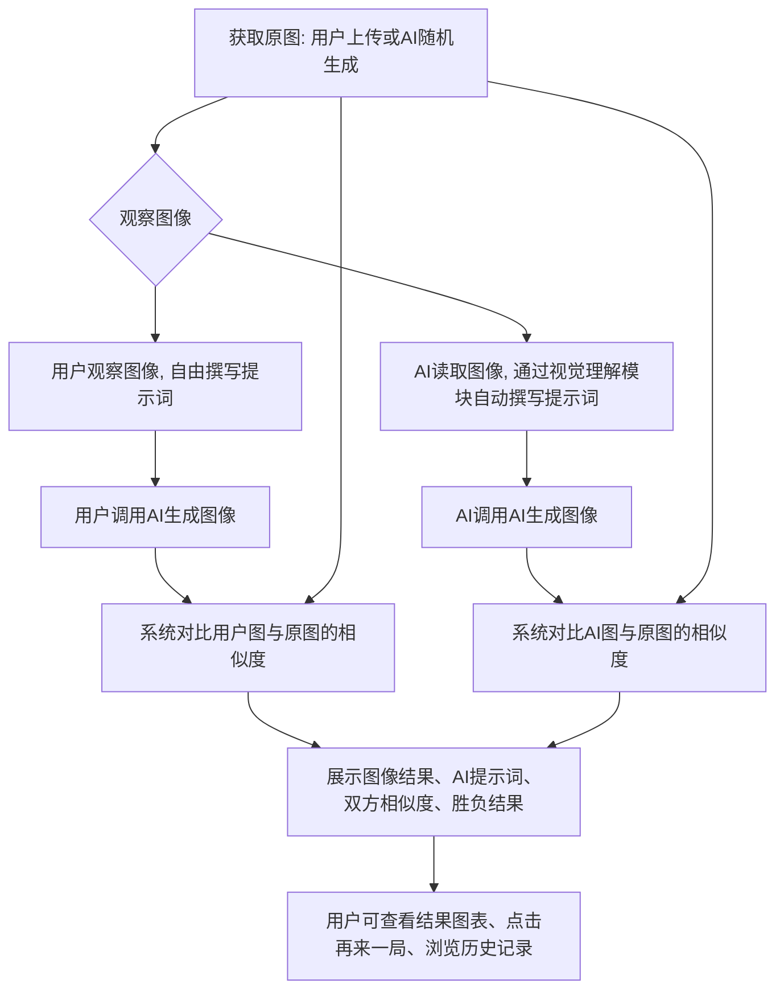
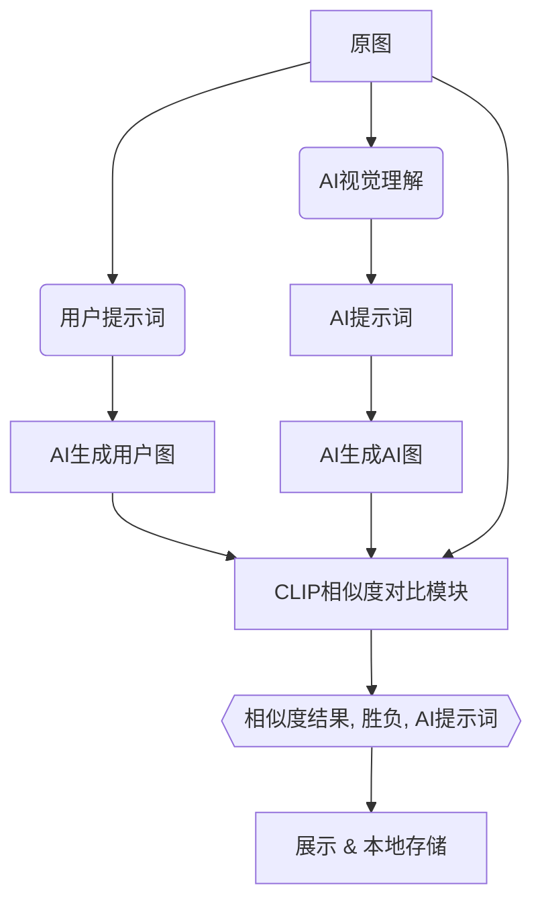

# 看图说话——提示词生图人机对抗小游戏

---

## 一、产品概述

### 项目名称 
AI对抗提示词生成图像小游戏

### 产品类型  
网页端 · 单页面 · AI互动游戏

### 产品目标  
用户通过观察图片并撰写提示词，与 AI 识图撰写提示词进行对抗，分别依据人、机撰写的生成图像，通过计算图像相似度评比“谁的提示词写得更好”。提升用户对多模态AI能力的理解与参与度，增加人机互动乐趣。

---

## 二、设计理念与风格

### 设计关键词  
- 🎨 **简约**：结构清晰，界面干净，信息层次分明  
- ✨ **现代**：响应式布局、渐变背景、微动效、模块卡片式布局  
- 🎲 **有趣**：游戏化交互、对抗机制、视觉反馈强、玩家可控程度高

---

## 三、核心玩法流程



---

## 四、功能模块说明

| 模块             | 功能项                                         | 描述                                                         |
| ---------------- | ---------------------------------------------- | ------------------------------------------------------------ |
| 图像获取         | 上传图像 / 随机图像                            | 获取游戏用的原图                                             |
| 提示词控制器     | 语言切换（中/英）<br>字符数上限设定            | 提升可玩性与挑战性，增加设定策略                             |
| 用户提示词生成区 | 输入框 + 按钮                                  | 玩家自行撰写提示词，调用AI图像生成                           |
| AI提示词生成区   | 自动生成                                       | 自动生成提示词，展示过程可略做动画延时                       |
| 生成图片区       | 玩家生成图 / AI生成图                          | 并列显示，带提示标签                                         |
| 相似度比较区     | 百分数艺术字展示                               | 使用大号渐变艺术字体 + 胜负判断动画提示                      |
| 结果展示区       | 胜负判断 + AI提示词                            | 提示语带动画效果，例如 "{用户名}赢了!"                       |
| 控制栏           | 再来一局 / 查看历史记录                        | 浏览器本地存储或 session 保存                                |
| 数据埋点         | 提示词长度 / 语言 / 成功率/ 点击（次数、时间） | 用于后端分析可视化                                           |
| 看板与可视化     | 游戏参与数据展示                               | 提供管理端看板入口（后台）                                   |
| 游戏记录可视化   | 玩家游玩记录图表                               | 雷达图 / 热力图展示提示词表现或偏好<br>其他对游玩记录的简单描述性统计 |

---

## 五、页面与数据流程设计

### 页面信息流（用户视角）

`````mermaid
graph LR
    A[上传图像] --> B[自定义提示词语言和限制];
    B --> C[撰写提示词];
    C --> D[比较结果];
    D --> E[再玩一局或查看历史记录];
`````


### 数据流（系统视角）



---

## 六、技术实现建议

| 项目         | 技术栈                                                       |
| ------------ | ------------------------------------------------------------ |
| 前端         | Vite + React                                                 |
| 后端         | Django + Django REST Framework（接口层）                     |
| 图像生成     | MOE LLM api                                                  |
| AI提示词生成 | MOE LLM api                                                  |
| 相似度计算   | CLIP                                                         |
| 埋点收集     | 前端埋点 SDK ——> Django                                      |
| 数据可视化   | 前端：Chart.js / Echarts；后端：Django admin 或自定义看板页面 |
| 历史记录     | LocalStorage（前端单用户）或 Django session/cookie 储存      |

---

## 七、运营数据埋点设计

| 埋点项               | 描述                       |
| -------------------- | -------------------------- |
| 游玩次数             | 每次“再来一次”或首轮计数   |
| 胜负比例             | 统计用户胜率               |
| 提示词语言           | 中/英切换记录              |
| 字符数设定           | 每局字符数上限             |
| 用户提示词长度       | 实际长度分布               |
| 相似度得分分布       | 用户 vs AI 的平均分趋势    |
| 提示词内容关键词提取 | 可做兴趣偏好分析（如词云） |

---

## 八、结果可视化设计

### 游戏内可视化  
- **相似度百分比**：使用大号艺术字展示
  - 渐变背景 + 字体发光 + 动效（如增长动画）
- **胜负提示**：使用模态弹窗或浮动Banner  
  - 🎉 “你赢了！” / 🤖 “AI胜利！”
- **玩家游玩历史提示词/战绩数据**：提示词特征和战绩描述性统计

### 游戏外可视化（后台运营看板）
- 用户参与热度
- 玩家提示词特征
- 胜率对比图：柱状图/堆叠图
- 玩家个体数据

---

## 九、扩展功能

- 登录用户系统：历史战绩、排行榜、等级
- 成就系统：达成特定提示词、胜率连胜等
- 社交分享：生成结果图可下载或分享链接


---

# To-Do List

- [x] **第一阶段：项目基础与环境配置**
  
    - [x] 创建 Django 项目并初始化 Git 仓库。
    - [x] 设置并激活 `uv` 虚拟环境。
    - [x] 安装所有基础 Python 依赖。
    - [x] 解决并配置 PyCharm IDE 与 `uv` 环境的集成问题。
    
- [x] **第二阶段：数据库配置**
    - [x] 决定并切换后端数据库为 MySQL。
    - [x] 在本地 MySQL 服务器中创建专用的数据库和用户。
    - [x] 在项目中安装 `mysqlclient` 驱动。
    - [x] 使用 `.env` 文件和 `python-dotenv` 安全地配置数据库连接信息。
    - [x] 在新的 MySQL 数据库上成功运行 Django 的初始迁移。

- [x] **第三阶段：核心应用与数据模型**
    - [x] 创建 `gamecore` 应用并注册到 `INSTALLED_APPS`。
    - [x] 定义 `GameRound` 模型以存储核心游戏数据。
    * [x] 定义 `GameEvent` 模型以支持数据埋点功能。
    
    - [x] 成功为 `gamecore` 应用创建并应用了所有数据库迁移。
    
- [x] **第四阶段：用户认证系统**
    - [x] 安装并配置 `dj-rest-auth` 和 `django-allauth`。
    - [x] 为认证应用创建数据库表。
    - [x] 成功配置并测试了用户注册、登录、登出等 API 接口。
    - [x] 解决了 DRF 可浏览 API 的登录/登出链接显示问题。
    - [x] 将 `GameRound` 模型与 `User` 模型关联，实现了游戏记录与用户的绑定。

- [x] **第五阶段：AI 服务集成**
  
    - [ ] ~~调试并解决访问 Google Gemini API 的网络和权限问题。~~
    * [x] 成功切换并确定使用豆包 API 作为文生图和图生文的服务。
    - [x] 创建了 `ai_services.py` 服务模块来封装所有外部 AI 调用。
    - [x] 成功集成本地 `sentence-transformers` (CLIP) 模型用于图像相似度计算。
    - [x] 成功集成豆包 API，实现了真实的图生文和文生图功能。
    
- [x] **第六阶段：核心 API 开发**
    - [x] 安装并配置 Django REST Framework (DRF)。
    - [x] 创建了所有必要的序列化器 (Serializer)。
    * [x] 解决了序列化器与数据库查询结果不匹配的问题。
    - [x] 实现了文件上传的处理逻辑，包括 `MEDIA_ROOT` 和 `MEDIA_URL` 的配置。
    - [x] 实现了完整的游戏开局 API (`/api/start_game/`)，支持 AI 生成和用户上传两种模式。
    - [x] 实现了完整的核心游戏回合 API (`/api/play_turn/`)，并与用户认证关联。
    - [x] 实现了受保护的用户个人历史记录 API (`/api/history/`)。
    - [x] 实现了基于“战胜AI次数”的复杂排行榜 API (`/api/leaderboard/`)。
    - [x] 实现了数据埋点 API (`/api/log_event/`)。

- [x] **第七阶段：后台管理优化**
  
    - [x] 将所有自定义模型注册到 Django Admin。
    - [x] 自定义了 `ModelAdmin`，提升了 Admin 后台数据的可读性和管理效率。

- [x] **第八阶段：前端基础与环境搭建**
  - [x] 使用 Vite 初始化 React 项目。
  - [x] 集成并配置 Tailwind CSS 用于快速 UI 开发。
  - [x] 建立标准化的前端项目目录结构 (components, pages, services 等)。
  - [x] 封装 API 服务层，集中管理所有对后端接口的请求。
  - [x] 实现全局认证上下文 (Auth Context) 以跨组件管理用户登录状态。

- [x] **第九阶段：前端核心 UI 与游戏流程**
  
  - [x] 配置 `react-router-dom` 并创建包含导航和页脚的主布局 (Layout)。
  - [x] 开发登录与注册页面，并完成与用户认证 API 的对接。
  - [x] 实现游戏主页的开局界面与逻辑 (上传或随机图片)。
    - [x] 为后端集成 drf-spectacular API 文档生成工具
  - [x]  实现核心游戏操作界面 (展示原图、提示词输入)。
  - [x] 实现游戏回合结束后的结果动态展示界面。
    - [x] 重构并优化UI/UX
  
- [ ] **第十阶段：前端功能完善与体验优化**
  - [ ] 开发历史战绩页面，调用接口并展示用户个人的游戏记录。
  - [ ] 开发排行榜页面，调用接口并展示全服玩家排名。
  - [ ] 在前端各个关键交互点集成数据埋点 API 的调用。
  - [ ] 实现完整的响应式设计，确保应用在移动端和桌面端都有良好的体验。
  - [ ] 进行 UI 细节打磨并添加动画效果，提升趣味性。

- [ ] **第十一阶段：部署与上线**
  - [x] 对前端应用进行生产环境构建 (Build)。
  - [x] 配置 Django 以正确托管和提供前端的静态文件。
  - [x] 配置生产服务器所需的环境变量 (密钥、数据库、域名等)。
  - [ ] 在部署前进行完整的端到端 (End-to-End) 测试。
  - [ ] 最终完成并整理项目的部署与维护文档。

